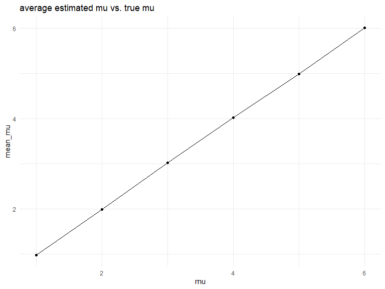

hw5
================
Xiangxiong Feng
2023-11-15

# Problem 2

``` r
zip_path = 
  tibble(
    path = 
      list.files(path = 'zip_file' ,pattern = "\\.csv$", full.names = TRUE))
```

``` r
zip_name = 
  tibble(
    file_name = list.files(path = 'zip_file')
    )|>
  bind_cols(zip_path)|>
  mutate(file = map(path, read.csv))|>
  unnest(file)|>
  pivot_longer(
    week_1:week_8,
    names_to = 'week',
    values_to = 'value',
    names_prefix = 'week_'
  )|>
  separate(file_name, into = c('arm', 'id'))|>
  mutate(week = as.numeric(week))
```

# spaghetti plot

``` r
#control arm
zip_name|>
  ggplot(aes(x = week, y = value, group = arm, color = arm)) +
  geom_path() +facet_grid(.~arm)
```


Generally, control group shows irregular change over time. On the other
side, the outcome values of experiment group are increased with the
change of time.

# Problem 3

# association between effect size and test power

``` r
simulate_test = function(mu, n=30, sigma =5, alpha = 0.05) {
  data =
    rnorm(n, mean = mu, sd = sigma)
  
  t_result = 
    t.test(data, alpha = 0.05)|>
    broom::tidy()
  
  estimate = t_result$estimate
  p_value = t_result$p.value
  
  table =
    tibble(
      mu_hat = estimate,
      p_value = p_value,
    )
  
  table
}
```

``` r
sim_results_df = 
  expand_grid(
    mu = c(1,2,3,4,5,6),
    iter = 1:5000
  ) |> 
  mutate(
    results = map(mu, simulate_test)
  ) |> 
  unnest(results)|>
  mutate(test_power = case_when(
    p_value <= 0.05 ~ 'rejected',
    p_value > 0.05 ~ 'failed'
  ))
```

``` r
sim_results_df|>
  group_by(test_power, mu)|>
  filter(test_power == 'rejected')|>
  summarise(n_obs = n())|>
  mutate(rejected_proportion = n_obs/sum(n_obs))|>
  ggplot(aes(x = mu, y = rejected_proportion)) + geom_point()+geom_line() + ggtitle('association between effect size and test power')
```

    ## `summarise()` has grouped output by 'test_power'. You can override using the
    ## `.groups` argument.


The proportion of ‘rejected’ (the power of the test) is increasing with
a larger effect size.

# relation between average estimated mu and true mu

``` r
sim_results_df|>
  group_by(mu)|>
  summarise(mean_mu = mean(mu_hat))|>
  ggplot(aes(x = mu, y = mean_mu)) + geom_point()+geom_line()+ggtitle('average estimated mu vs. true mu')
```



``` r
sim_results_df|>
  filter(test_power == 'rejected')|>
  group_by(mu)|>
  summarise(mean_mu = mean(mu_hat))|>
  ggplot(aes(x = mu, y = mean_mu)) + geom_point()+geom_line()+ggtitle('average estimated mu when null is rejected vs. true mu')
```


From two plots above, we can see that the sample average estimated mu
for which null is rejected only approximately equal to the true mu when
the true mu is relatively large (\>4). This is because a larger effect
size can increase the power of the test.
